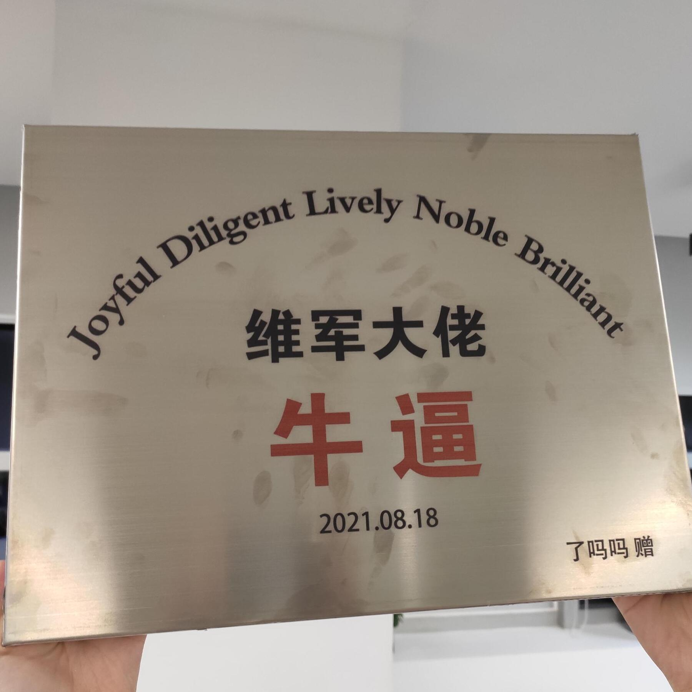

# WJDLNB 前端站点

`WJDLNB`：维军大佬牛逼！！！



## 结构

`./src` 目录下保存 `wjdlnb` 前端站点代码，包括页面路由、页面侧边栏、页面、页面组件等

## 开发

### 依赖

```shell
# fec-builder 版本
fec-builder --version
>= 1.17.0

# node 版本
>= 12.0.0
```

### 目录结构

项目的主体代码都放在 `./src` 中，相当于一般 `React` 项目中的根目录。其文件划分基本类似 `Portal React` 项目，目前具体划分如下：

```shell
./src
  ├── apis # 接口相关
  ├── components # Layout、页面、业务相关组件等
  ├── constants # 常量相关
  ├── global
  ├── stores # 全局 store
  ├── utils # 各种 tools && hooks
  └── ... # 后续有需要再添加新的目录
```

- `apis` / `components` / `constants` / `global` / `stores` / `utils`

  类似 `Portal React` 项目中的规范所定义的功能

### 运行项目

项目使用 [fec-builder](https://github.com/Front-End-Engineering-Cloud/builder) 进行构建，配置文件（本地和测试环境）使用的是项目根目录的 [build-config.json](./build-config.json)

线上使用 [build-config.prod.json](./build-config.prod.json)（覆盖 `HOSTS_CONFIG, ALLOW_DOMAINS` 为线上对应的参数）

使用姿势有两种：

#### npm 包（适合本地开发用）

```shell
# fec-builder 使用 npm-shrinkwrap.json 锁定依赖版本，yarn 不会识别 npm-shrinkwrap.json
# 这里请使用 npm 安装全局包
# https://www.npmjs.com/package/fec-builder
npm i fec-builder -g
# 项目目录下执行
# 安装依赖
yarn
# 启动本地服务
yarn run dev
# 本地访问地址
http://localhost:8080 || http://localhost:8080/overview
# 均会显示 http://localhost:8080/overview 页面
```

#### docker 镜像（适合持续集成环境使用）

> 镜像仓库地址：https://c.163yun.com/hub#/m/repository/?repoId=52876

```shell
docker pull hub.c.163.com/nighca/fec-builder:latest
# 项目目录下执行
docker run -v ${PWD}:/fec/input -e "BUILD_ENV=production" --rm fec-builder
```

`npm` 包与 `docker` 镜像的对比，优点：

* 不需要安装 `docker`，通过淘宝镜像源的话装起来应该也比 `docker pull image` 快
* 构建行为直接在宿主机运行，性能会比在容器中稍好，首次构建大约会快 `20%`

缺点：

* 没有那么可靠，安装时可能会出错（往往错在 `node` 构建二进制包的部分），构建行为也不能保证完全一致

更多详情可以参考 `fec-builder` 的项目 [主页](https://github.com/Front-End-Engineering-Cloud/builder)

### 依赖管理

依赖使用 `yarn` 管理，安装依赖执行 `yarn`，更新依赖执行 `yarn upgrade`

### TODO: UT
